# ContextCache Architecture - Complete Breakdown

## Current Deployment Status

```mermaid
graph TB
    subgraph "DEPLOYED ✅"
        FW[Frontend Worker<br/>contextcache-frontend<br/>Cloudflare Worker<br/>🌐 contextcache-frontend.doddanikhil.workers.dev]
        style FW fill:#90EE90
    end

    subgraph "NOT DEPLOYED ❌"
        API[Backend API<br/>FastAPI Python<br/>❌ Only on localhost:8000]
        style API fill:#FFB6C6
    end

    subgraph "EXTERNAL SERVICES (Cloud) ✅"
        NEON[(Neon Postgres<br/>Database<br/>🗄️ Production Ready)]
        UPSTASH[(Upstash Redis<br/>Cache + Rate Limiting<br/>⚡ Production Ready)]
        CLERK[Clerk.com<br/>Authentication<br/>🔐 Production Ready]
        style NEON fill:#87CEEB
        style UPSTASH fill:#87CEEB
        style CLERK fill:#87CEEB
    end

    USER[👤 User Browser<br/>thecontextcache.com] -->|HTTPS| FW
    FW -->|❌ BROKEN<br/>Tries to call localhost:8000| API
    API -->|✅ Works| NEON
    API -->|✅ Works| UPSTASH
    FW -->|✅ Works| CLERK

    style USER fill:#FFE4B5
```

**PROBLEM**: Frontend is deployed, but backend is NOT deployed. Frontend tries to call `localhost:8000` which doesn't exist in production!

---

## Full Architecture - How It Should Work

```mermaid
graph TB
    subgraph "USER DEVICES"
        BROWSER[👤 User's Browser<br/>Chrome/Firefox/Safari<br/>thecontextcache.com]
        MOBILE[📱 Mobile Device<br/>thecontextcache.com]
    end

    subgraph "CLOUDFLARE GLOBAL NETWORK"
        DNS[☁️ Cloudflare DNS<br/>thecontextcache.com<br/>Routes traffic]

        subgraph "Cloudflare Workers (Edge Computing)"
            FE[🎨 Frontend Worker<br/>Next.js React App<br/>HTML/CSS/JavaScript<br/>contextcache-frontend]
            BE[🔧 Backend Worker<br/>Python FastAPI<br/>Business Logic<br/>contextcache-api<br/>❌ NOT DEPLOYED YET]
        end

        CDN[⚡ Cloudflare CDN<br/>Static Assets<br/>Images, CSS, JS bundles]
    end

    subgraph "AUTHENTICATION (Clerk.com)"
        CLERK_AUTH[🔐 Clerk Authentication<br/>User Login/Signup<br/>Session Management<br/>JWT Tokens]
        CLERK_DB[(Clerk Database<br/>User accounts<br/>Passwords<br/>Sessions)]
    end

    subgraph "DATABASE LAYER (Neon.tech)"
        NEON_POOL[⚡ Connection Pooler<br/>Manages DB connections]
        NEON_DB[(🗄️ PostgreSQL Database<br/>ep-soft-cloud-adkmatwy<br/><br/>STORES:<br/>- Projects<br/>- Facts<br/>- Entities<br/>- Relations<br/>- Embeddings<br/>- User data)]
    end

    subgraph "CACHE LAYER (Upstash.io)"
        UPSTASH_API[⚡ Upstash REST API<br/>HTTP Interface]
        UPSTASH_REDIS[(⚡ Redis Cache<br/>sunny-basilisk-20580<br/><br/>STORES:<br/>- Rate limits<br/>- Session cache<br/>- Query cache<br/>- Job queues<br/>- Temporary data)]
    end

    subgraph "BACKGROUND JOBS"
        WORKER[⚙️ Worker Process<br/>Background Tasks<br/>❌ NOT DEPLOYED YET<br/><br/>DOES:<br/>- PageRank calculation<br/>- Time decay updates<br/>- Embedding generation<br/>- Graph analysis]
    end

    BROWSER -->|1. Visit thecontextcache.com| DNS
    MOBILE -->|1. Visit thecontextcache.com| DNS
    DNS -->|2. Route to nearest edge| FE
    FE -->|3. Serve HTML/CSS/JS| CDN
    FE -->|4. Check if user logged in| CLERK_AUTH
    CLERK_AUTH <-->|User credentials| CLERK_DB
    FE -->|5. API Requests BROKEN| BE
    BE -->|6. Save/Query data| NEON_POOL
    NEON_POOL -->|SQL Queries| NEON_DB
    BE -->|7. Rate limiting Cache| UPSTASH_API
    UPSTASH_API <-->|Redis commands| UPSTASH_REDIS
    BE -->|8. Queue jobs| UPSTASH_REDIS
    UPSTASH_REDIS -->|9. Job queue| WORKER
    WORKER -->|10. Update data| NEON_DB

    style BROWSER fill:#FFE4B5
    style MOBILE fill:#FFE4B5
    style DNS fill:#87CEEB
    style FE fill:#90EE90
    style BE fill:#FFB6C6
    style CDN fill:#87CEEB
    style CLERK_AUTH fill:#DDA0DD
    style CLERK_DB fill:#DDA0DD
    style NEON_POOL fill:#98FB98
    style NEON_DB fill:#98FB98
    style UPSTASH_API fill:#FFD700
    style UPSTASH_REDIS fill:#FFD700
    style WORKER fill:#FFB6C6
```

---

## What Each Service Does

### 1. Frontend (Cloudflare Worker) - ✅ DEPLOYED
**Location**: contextcache-frontend.doddanikhil.workers.dev  
**Technology**: Next.js 15 (React)  
**What it does**:
- Serves the website (HTML, CSS, JavaScript)
- Handles page routing (/dashboard, /ask, /graph, etc.)
- Renders UI components
- Runs in Cloudflare's edge network (280+ cities worldwide)
- **Does NOT store any data** - just displays it

### 2. Backend API - ❌ NOT DEPLOYED
**Should be**: contextcache-api.doddanikhil.workers.dev  
**Technology**: Python FastAPI  
**What it does**:
- Receives requests from frontend
- Business logic (create projects, search facts, encryption)
- Talks to database (Neon) and cache (Upstash)
- Returns JSON responses

### 3. Database (Neon Postgres) - ✅ READY
**Location**: ep-soft-cloud-adkmatwy-pooler.c-2.us-east-1.aws.neon.tech  
**Stores**: Projects, Facts, Entities, Relations, Embeddings

### 4. Cache (Upstash Redis) - ✅ READY
**Location**: sunny-basilisk-20580.upstash.io  
**Stores**: Rate limits, Query cache, Session cache, Job queues

### 5. Authentication (Clerk.com) - ✅ READY
**Handles**: User signup, login, sessions, JWT tokens

---

## Summary: What's Deployed vs Not Deployed

| Component | Status | Location |
|-----------|--------|----------|
| **Frontend** | ✅ DEPLOYED | Cloudflare Worker |
| **Backend API** | ❌ NOT DEPLOYED | localhost only |
| **Database** | ✅ READY | Neon Postgres (cloud) |
| **Cache** | ✅ READY | Upstash Redis (cloud) |
| **Auth** | ✅ READY | Clerk.com (cloud) |
| **Worker Jobs** | ❌ NOT DEPLOYED | Not running |

**PROBLEM**: Frontend can't talk to backend because backend is only on localhost!

---

## Next Steps

1. **Deploy Backend API** (choose one):
   - Option A: Cloudflare Worker
   - Option B: Google Cloud Run
   - Option C: Railway/Render

2. **Add Environment Variables** to both frontend and backend

3. **Test** the full stack working together

Want me to help deploy the backend?
