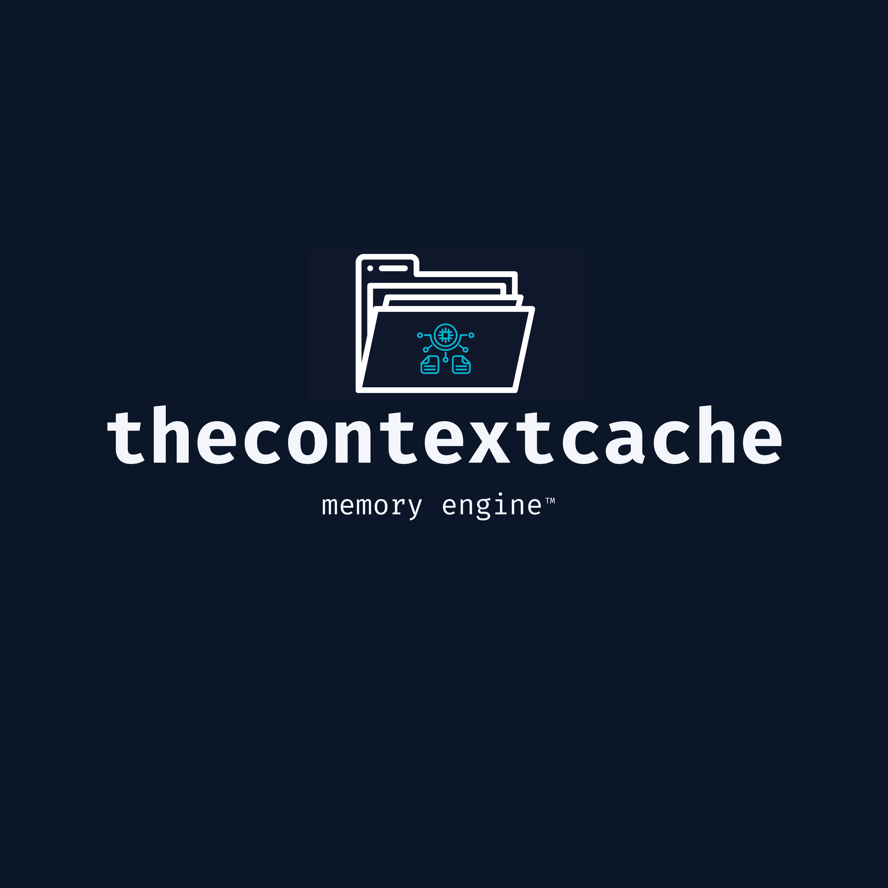

<p align="center">
  
</p>

<h1 align="center">ContextCache</h1>
<p align="center">Privacy-first memory engine for AI research</p>

<p align="center">
  <a href="https://thecontextcache.bsky.social">Website</a> •
  <a href="https://github.com/thecontextcache/contextcache/blob/main/docs/quickstart.md">Quickstart</a> •
  <a href="https://github.com/thecontextcache/contextcache/blob/main/docs/overview.md">Docs</a>
</p>

---

# ContextCache

A privacy-first, local-first memory engine for AI research. Ingest documents, extract knowledge quads, rank them with explainable algorithms, and get traceable answers with full audit chains.

## 🎯 What is ContextCache?

ContextCache transforms documents into a queryable knowledge graph where every fact is:
- **Traceable**: Full provenance from source to answer
- **Explainable**: Confidence scores and reasoning paths
- **Auditable**: Cryptographically verifiable event chains
- **Portable**: Export/import signed Memory Packs
- **Private**: End-to-end encryption, local-first design

## 🏗️ Architecture

- **Frontend**: Next.js (TypeScript, Tailwind) on Cloudflare Pages
- **Backend**: FastAPI (Python 3.13) with 5 MCP servers on Cloud Run
- **Database**: Neon Postgres with pgvector
- **Queue**: Upstash Redis
- **Crypto**: XChaCha20-Poly1305, Ed25519, Argon2id, BLAKE3

## 🚀 Quick Start
```bash
# Clone
git clone https://github.com/thecontextcache/contextcache.git
cd contextcache

# Copy environment template
cp .env.example .env.local

# Start local stack (Mac Apple Silicon supported)
docker-compose -f infra/docker-compose.dev.yml up

# Frontend runs on http://localhost:3000
# API runs on http://localhost:8000

Full Instructions: docs/quickstart.md

Documentation

Overview — Philosophy and features
Security Model — Cryptography and threat model
Data Model — Quads, provenance, Memory Packs
MCP Servers — Tool APIs for agents
API Reference — REST and GraphQL
Cookbook — Common workflows

Tech Stack
LayerTechnologyFrontendNext.js 15, TypeScript, Tailwind, Zustand, CytoscapeBackendFastAPI, Pydantic v2, MCP ProtocolDatabaseNeon Postgres (pgvector)Cache/QueueUpstash RedisCryptoPyNaCl, Argon2-CFFI, BLAKE3Testingpytest, Hypothesis, vitest, Playwright, k6SecurityAikido, Trivy, RenovateDocsMintlify
🔐 Security First

Zero-knowledge: Project keys derived from user passphrases (Argon2id)
Encrypted at rest: XChaCha20-Poly1305 for all user content
Signed exports: Ed25519 signatures on Memory Packs
Audit chains: BLAKE3-linked event logs
No accounts: Privacy by design

Read the full threat model
🤝 Contributing
We welcome contributions! Please see:

CONTRIBUTING.md — Guidelines and workflow
CODE_OF_CONDUCT.md — Community standards
SECURITY.md — Report vulnerabilities

📜 License
Dual-licensed:

Apache 2.0 for non-commercial use
PolyForm Noncommercial for evaluation

See LICENSING.md for details.
💬 Community

Discussions — Q&A and ideas
Issues — Bug reports and features

🙏 Support
If ContextCache helps your research:

⭐ Star the repo
💰 GitHub Sponsors
🎁 OpenCollective


Built for researchers who need answers they can trust.