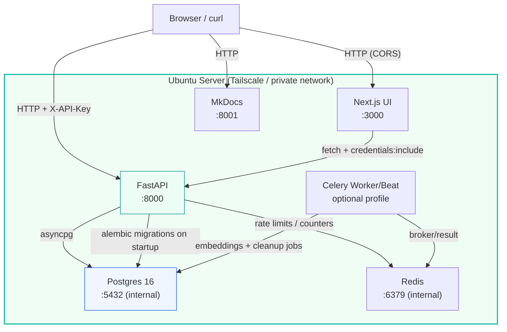
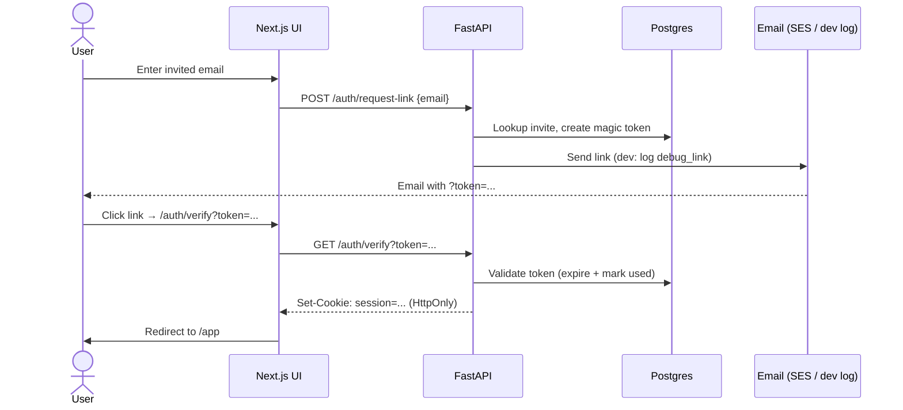
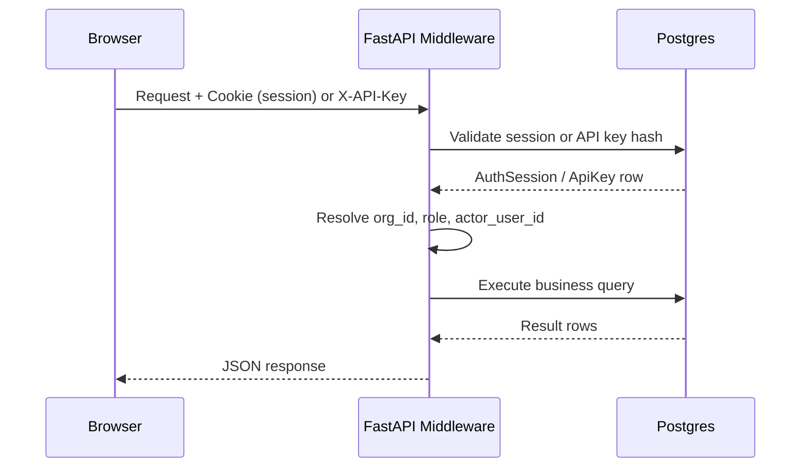

# Architecture

## System Overview



---

## Auth Flow — Magic Link



---

## Request Lifecycle



---

## Components

### 1. FastAPI (API Server)

**Purpose:** Handle all HTTP requests for projects, memory cards, and recall.

**Key details:**
- Written in Python with FastAPI framework
- Connects to Postgres via SQLAlchemy (async)
- Runs in Docker container
- Exposes port 8000

**Endpoints:** See [API Contract](04-api-contract.md)

### 2. Postgres (Database)

**Purpose:** Persistent storage for projects and memory cards.

**Key details:**
- Standard Postgres 16 image
- Data persisted in Docker volume (`postgres_data`)
- Only accessible from within Docker network (not exposed externally)
- Schema managed by SQLAlchemy models

**Tables:** See [Data Model](03-data-model.md)

### 3. MkDocs (Documentation)

**Purpose:** This documentation site—project dashboard and runbooks.

**Key details:**
- Material theme for clean UI
- Runs in Docker container
- Exposes port 8001
- Auto-rebuilds on file changes (dev mode)

### 4. Next.js (Tiny Web UI)

**Purpose:** Fast shareable interface for creating memories and exporting recall output.

**Key details:**
- Next.js app-router frontend
- Runs in Docker container
- Exposes port 3000
- Calls FastAPI directly (CORS-enabled)

---

## Data Flow

### Write Path (Create Memory Card)

```
User                    API                     Postgres
  │                      │                         │
  │  POST /memories      │                         │
  │─────────────────────▶│                         │
  │                      │  INSERT INTO memories   │
  │                      │────────────────────────▶│
  │                      │                         │
  │                      │  Return new record      │
  │                      │◀────────────────────────│
  │  { id, type, ... }   │                         │
  │◀─────────────────────│                         │
```

### Read Path (Recall Memory Pack)

```
User                    API                     Postgres
  │                      │                         │
  │  GET /recall?query=  │                         │
  │─────────────────────▶│                         │
  │                      │  CAG pre-check (golden docs) │
  │                      │  if miss: hybrid query        │
  │                      │  FTS + pgvector + recency     │
  │                      │────────────────────────▶│
  │                      │                         │
  │                      │  Return matching rows   │
  │                      │◀────────────────────────│
  │                      │                         │
  │                      │  Format as memory pack  │
  │                      │  (text block)           │
  │                      │                         │
  │  { memory_pack_text, │                         │
  │    items: [...] }    │                         │
  │◀─────────────────────│                         │
```

---

## Why This Works for "Unlimited Context"

We don't try to expand the model's context window. That's the model's job.

Instead, we produce a **curated memory pack**:

1. **Human curation** — Only high-signal cards are stored (no noise)
2. **Query-scoped** — Recall returns only relevant cards for the query
3. **Size-limited** — The `limit` parameter caps output size
4. **Paste-ready** — Formatted text is easy to paste without editing

Result: Prompts stay small, signal stays high.

---

## Technology Choices

| Component | Choice | Rationale |
|-----------|--------|-----------|
| Language | Python 3.11+ | Team familiarity, ecosystem |
| Framework | FastAPI | Modern, fast, auto-docs |
| Database | Postgres | Reliable, battle-tested |
| ORM | SQLAlchemy | Flexible, async support |
| Package manager | uv | Fast, lockfile-based |
| Containers | Docker Compose | Simple multi-service orchestration |
| Docs | MkDocs Material | Clean, markdown-based |

---

## Future Architecture (Post-MVP)

Phase 2+ may add:
- advanced re-ranking (RRF / learned ranking)
- dedicated analyzer microservice
- external auth providers (OIDC/SSO)
- multi-region deployment patterns

Beta currently runs hybrid retrieval, Redis-backed limits, and optional worker jobs.
