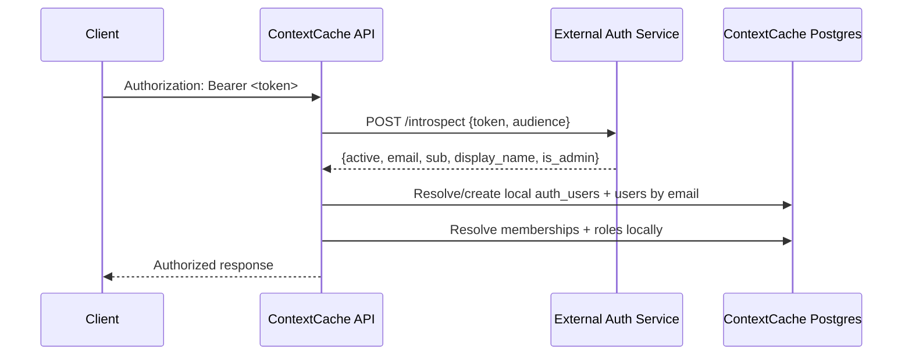

# External Auth Bridge

ContextCache is moving toward a split architecture:

- a dedicated auth service handles authentication
- ContextCache remains the resource server for projects, memories, orgs, and authorization

This document defines the bridge contract so the future auth repo can be built
independently without forcing a rewrite of ContextCache routes.

## Design boundary

The external auth service is responsible for:

- verifying bearer tokens
- owning login/session issuance in its own repo
- returning a stable identity payload

ContextCache is responsible for:

- local `users` and `memberships`
- org scoping and role checks
- API keys
- audit logs and usage counters
- admin authorization unless explicitly delegated

That split is intentional. Authentication and business authorization have
different failure modes and should not be coupled.

## Request flow



## Environment variables

```env
EXTERNAL_AUTH_ENABLED=false
EXTERNAL_AUTH_INTROSPECTION_URL=
EXTERNAL_AUTH_SERVICE_TOKEN=
EXTERNAL_AUTH_AUDIENCE=contextcache-api
EXTERNAL_AUTH_TIMEOUT_MS=1500
EXTERNAL_AUTH_ALLOW_INSECURE_HTTP=false
EXTERNAL_AUTH_TRUST_ADMIN_CLAIMS=false
```

## Introspection request contract

Method:

```http
POST ${EXTERNAL_AUTH_INTROSPECTION_URL}
Content-Type: application/json
Authorization: Bearer ${EXTERNAL_AUTH_SERVICE_TOKEN}
```

Body:

```json
{
  "token": "<bearer-token>",
  "audience": "contextcache-api"
}
```

Notes:
- `Authorization` for the auth-service call is optional and only sent when
  `EXTERNAL_AUTH_SERVICE_TOKEN` is configured.
- `audience` is optional at the transport level but recommended so the auth
  service can enforce token audience.

## Introspection response contract

Success response:

```json
{
  "active": true,
  "email": "user@example.com",
  "sub": "user_123",
  "display_name": "User Name",
  "is_admin": false
}
```

Field requirements:
- `active`: required boolean
- `email`: required when `active=true`
- `sub`: optional for now; reserved for future subject-based mapping
- `display_name`: optional, used only for local user bootstrap
- `is_admin`: optional, ignored unless `EXTERNAL_AUTH_TRUST_ADMIN_CLAIMS=true`

Inactive token response:

```json
{"active": false}
```

Operational rules:
- Return `200` for valid introspection requests, even when the user token is inactive.
- Reserve HTTP `401/403` for bad service credentials and HTTP `5xx` for auth-service failures.

## Local projection rules

When a bearer token is valid:

1. ContextCache finds or creates a local `auth_users` row by email.
2. ContextCache finds or creates a local `users` row by email and links it to `auth_users`.
3. ContextCache resolves org membership and role from `memberships`.
4. If the user has no org yet, they are authenticated but unscoped. They can still create a new org.

This keeps existing routes and audits working without rewriting them for an
external identity provider.

## Failure behavior

| Scenario | Result |
|---|---|
| Bearer token inactive | `401 Unauthorized` |
| Introspection endpoint misconfigured | `503 External auth misconfigured` |
| Introspection network failure / timeout | `503 External auth unavailable` |
| Local user disabled | `403 Forbidden` |
| Token valid but requested `X-Org-Id` has no local membership | `403 Forbidden` |

## Security decisions

- Keep `EXTERNAL_AUTH_TRUST_ADMIN_CLAIMS=false` by default.
- Do not move org-role checks into the auth service.
- Prefer HTTPS introspection; only allow HTTP on trusted internal networks.
- Treat the auth service as an identity dependency, not a permissions database.

## Migration path

Phase 1:
- magic-link sessions remain supported
- API keys remain supported
- bearer-token bridge stays disabled by default

Phase 2:
- build the separate auth service
- enable bearer introspection in staging
- verify user bootstrap, org access, and admin boundaries

Phase 3:
- decide whether session issuance fully moves out of ContextCache
- optionally add subject-based linking instead of email-only linking
