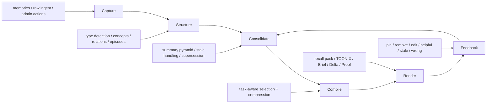

# Memory Compiler Architecture

## Purpose

This document describes how ContextCache evolves from a memory-recall system into a memory-compiler platform without discarding the current shipped API or operating model.

The key shift is architectural:

**from query-time retrieval only**

To:

**capture, structure, consolidate, compile, and render**

## End-To-End Pipeline

## Architectural Layers

### 1. Capture Layer

The capture layer is already present in the shipped system.

Current sources:

- `POST /projects/{project_id}/memories`
- `POST /integrations/memories`
- `POST /ingest/raw`
- batch actions and admin state changes

Responsibilities:

- persist raw source memories and captures
- preserve actor, project, org, and time metadata
- ensure evidence is durable before higher-order derivation begins

### 2. Structure Layer

The structure layer converts source inputs into typed memory objects.

New or expanded outputs:

- concepts
- episodes
- memory-to-memory relations
- memory state transitions
- typed extracted items such as decisions, constraints, and procedures

Responsibilities:

- classify memory role
- identify canonical concepts and aliases
- link related memories
- group related work into episodes

### 3. Consolidation Layer

The consolidation layer maintains durable project knowledge over time.

Derived outputs:

- summary nodes at multiple levels
- supersession chains
- conflict markers
- freshness and stale-state metadata

Responsibilities:

- reduce duplication
- preserve provenance
- identify stale or contradicted knowledge
- maintain project-level and org-level continuity

### 4. Compilation Layer

This is the new center of the system.

Inputs:

- query or task description
- project and org scope
- actor and permissions
- target model or target workflow
- token budget
- available evidence, concepts, episodes, and summaries

Responsibilities:

- select relevant source evidence
- select the right abstraction level
- preserve confidence and provenance
- optimize for usefulness under a budget

### 5. Rendering Layer

The renderer turns compiler output into a form usable by a consumer.

Renderers should include:

- existing recall pack text
- `TOON-X/1` compact transport
- `Brief/1` human-readable summary
- `Delta/1` change-focused output
- `Proof/1` evidence-first output
- raw `MIR/1` JSON for internal or advanced integrations

## Core Data Model Additions

The compiler architecture keeps PostgreSQL as the main system of record.

### Existing durable records

- organisations
- projects
- users and memberships
- memories
- raw captures
- recall logs and timings
- audit and usage records

### New structured memory records

- `concepts`
- `concept_aliases`
- `memory_concepts`
- `memory_relations`
- `episodes`
- `episode_memories`
- `summary_nodes`
- `context_compilations`
- `context_compilation_items`
- `retrieval_feedback`
- `memory_state_transitions`
- `query_profiles`

## Canonical Internal Representation

The compiler needs a canonical internal format so that storage, evaluation, and rendering do not drift apart.

That representation should be `MIR/1`.

Expected object kinds:

- fact
- decision
- constraint
- procedure
- episode
- concept
- artifact
- delta
- conflict
- unknown
- next_hop

Expected core fields:

- `id`
- `kind`
- `content`
- `scope`
- `confidence`
- `freshness`
- `importance`
- `rank`
- `concept_refs`
- `evidence_refs`
- `contradicts`
- `supersedes`
- `why_included`
- `time_scope`

## How The Current API Fits

The shipped API is the compatibility layer and early delivery surface for the compiler system.

### Current endpoints that remain foundational

- projects and org endpoints remain the scope model
- memory creation endpoints remain the evidence entry points
- ingest endpoints remain the raw capture entry points
- admin recall and ops endpoints remain the observability layer
- worker health and Redis health remain operational checks

### Current endpoints that get reinterpreted

- `GET /projects/{project_id}/recall`
  - becomes the first compiler renderer rather than the whole product
- `POST /integrations/memories/{memory_id}/contextualize`
  - becomes one form of derivation/enrichment
- `/brain/batch` and undo
  - become stateful memory mutation tools inside the compiler ecosystem

### Future endpoints to add

- project resume
- project delta
- concept listing and inspection
- context compile requests
- context feedback submission
- memory lifecycle transitions
- summary inspection endpoints

## Compiler Decision Inputs

The compiler should not treat every request as identical.

It should take these dimensions into account:

- actor and permission scope
- project and org scope
- task type
- requested output format
- token budget
- freshness requirements
- model destination
- recent project activity
- known user preferences or repeated workflows

## Model Roles

The memory compiler does not need one giant model first. It needs clear specialized jobs.

### `ContextCache-Embed-1`

Purpose:

- query, memory, and concept embeddings
- candidate retrieval

### `ContextCache-Rerank-1`

Purpose:

- rerank retrieved memories, summaries, and concepts
- optimize final candidate quality

### `ContextCache-Concept-1`

Purpose:

- extract concepts, procedures, decisions, constraints, and relations

### `ContextCache-Compress-1`

Purpose:

- produce token-efficient compilations with evidence preservation

### `ContextCache-Policy-1`

Purpose:

- decide what to keep, merge, age out, and surface for a given use case

## Runtime Components

### API

Responsibilities:

- request validation
- auth and permission enforcement
- compiler orchestration
- renderer selection
- response delivery

### PostgreSQL

Responsibilities:

- system of record
- structured memory store
- compilation artifact storage
- pgvector-backed candidate retrieval where enabled

### Redis

Responsibilities:

- rate limiting
- queue broker and results for worker jobs
- ephemeral coordination only

### Worker

Responsibilities:

- concept extraction
- relation linking
- summary refresh
- background compilation
- embedding and reranking support jobs
- evaluation export and maintenance tasks

## Operational Safety

The compiler architecture must preserve the operational discipline already added to the platform.

Required properties:

- evidence-first traceability
- org-safe scoping
- replay-safe ingest behavior
- background task idempotency where needed
- observable failure modes
- measurable quality via recall and compiler evaluation

## Compatibility Rules

To avoid a risky rewrite, the compiler migration should follow these rules.

### Rule 1

Current stable API routes remain valid unless explicitly versioned or replaced.

### Rule 2

New compiler structures are additive before they are mandatory.

### Rule 3

Recall remains supported as a renderer even after richer formats exist.

### Rule 4

Source memories always remain inspectable and traceable beneath derived outputs.

### Rule 5

No new architecture component is introduced unless it clearly reduces product or operational risk.

## Why PostgreSQL Still Works

PostgreSQL remains the correct core storage choice for this phase because it gives us:

- relational integrity for auth, projects, and lifecycle rules
- flexible JSON support for compiler artifacts
- FTS and analytical capabilities
- pgvector support for future or expanded embedding use
- simpler operations than splitting the system across graph and document stores too early

A graph database is not required to model graph-like relationships in the early compiler phases.

## Epsio Position

Epsio is optional and should not be in the first compiler wave.

Potential future role:

- incremental materialized views for project health rollups
- recent delta feeds
- compilation metrics dashboards
- concept usage aggregates

Not a first-wave role:

- transactional serving path
- vector retrieval
- compiler logic
- model training pipeline

## Architectural Summary

The memory-compiler architecture keeps the current platform foundation and adds three crucial capabilities:

1. structured derived memory beyond source cards
2. task-aware context compilation
3. multi-format rendering with evidence and feedback

That is the path from "memory recall product" to "memory compiler platform".
